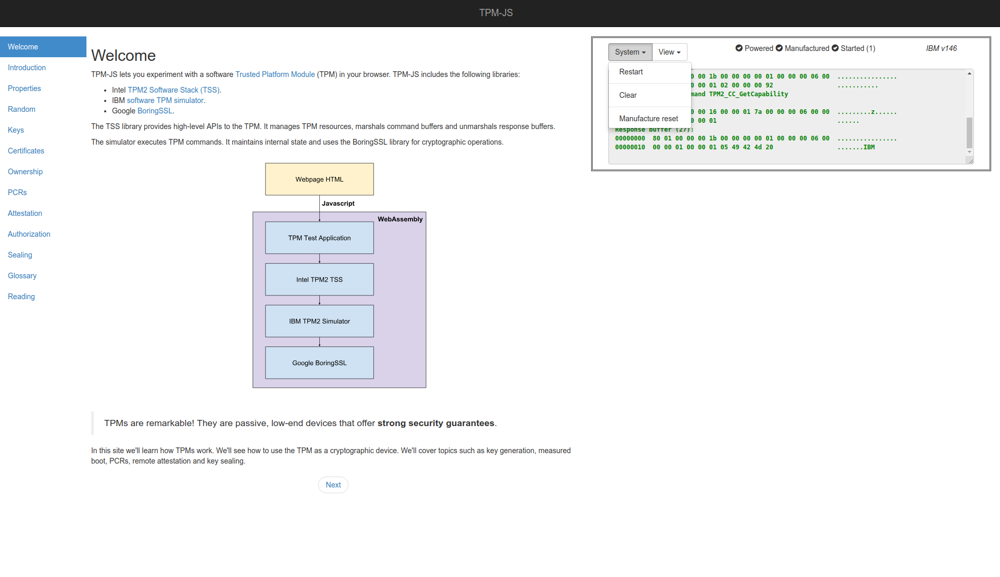
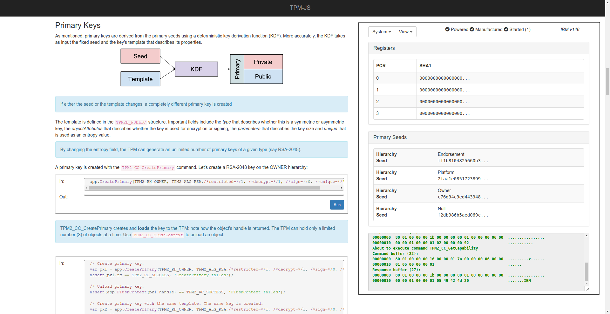
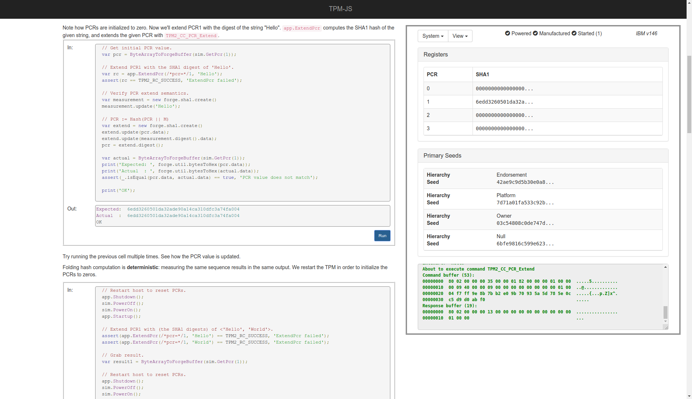

# Interactive TPM simulator with codelabs

## Overview

TPM-JS lets you experiment with a software
[TPM](https://en.wikipedia.org/wiki/Trusted_Platform_Module) device in your
browser. It's an educational tool that teaches you how to use a TPM device to
secure your workflows. The codelab like sessions cover topics such as key
generation, measured boot, remote attestation and sealing.

## Screenshots

Welcome screen: 

Keys codelab: 

PCRs codelab: 

## Architecture

TPM-JS includes the following libraries:

*   Intel [TPM2 TSS](https://github.com/tpm2-software/tpm2-tss).
*   IBM [software TPM simulator](https://sourceforge.net/projects/ibmswtpm2/).
*   Google [BoringSSL](https://boringssl.googlesource.com/boringssl).

The libraries are compiled to
[WebAssembly](https://en.wikipedia.org/wiki/WebAssembly), and accessed via
Javascript.

## Dependencies

*   [cmake](https://cmake.org/).
*   [Emscripten SDK](https://kripken.github.io/emscripten-site/docs/getting_started/downloads.html).
*   [Jinja2](http://jinja.pocoo.org/) template library.

## Build

Initialize git submodules:

```shell
git submodule update --init
```

Activate emsdk:

```shell
source {EMSDK PATH}/emsdk_env.sh
```

Build TPM-JS:

```shell
mkdir bulid-web
cd build-web
emcmake cmake ..
make -j4
```

Run unit-tests:

```shell
make check
```

Alternatively, you can build the project using the provided Docker file.

One time initialization:

```shell
./dcmake.sh
```

Then build using:

```shell
./dmake.sh -j4
```

## Serve Files

Add the line `application/wasm wasm` to `/etc/mime.types`.

Serve files from the built web package:

```shell
cd build-web/web
python3 -m http.server --bind 127.0.0.1 8000
```

## Disclaimer

This is not an official Google product (experimental or otherwise), it is just
code that happens to be owned by Google.
